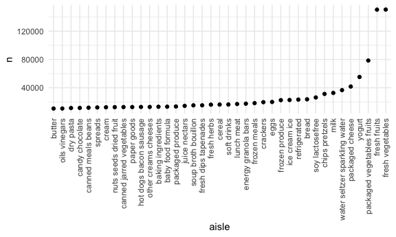

Homework 3
================
Ling Tuo
10/06/2020

-   [Problem 1](#problem-1)
-   [Problem 2](#problem-2)
-   [Problem 3](#problem-3)

This is my solution to HW3.

Problem 1
---------

    data("instacart")

This dataset contains 1384617 rows and 15 columns.

Observations are the level of items in orders by users. There are user /
order variables – user ID, order ID, order day, and order hour. There
are also item variables – name, aisle, department, and some numeric
codes.

How many aisles, and which are most items from?

    instacart %>% 
      count(aisle) %>% 
      arrange(desc(n))

    ## # A tibble: 134 x 2
    ##    aisle                              n
    ##    <chr>                          <int>
    ##  1 fresh vegetables              150609
    ##  2 fresh fruits                  150473
    ##  3 packaged vegetables fruits     78493
    ##  4 yogurt                         55240
    ##  5 packaged cheese                41699
    ##  6 water seltzer sparkling water  36617
    ##  7 milk                           32644
    ##  8 chips pretzels                 31269
    ##  9 soy lactosefree                26240
    ## 10 bread                          23635
    ## # … with 124 more rows

Let’s make a plot.

    plot_p1 = 
      instacart %>% 
      count(aisle) %>% 
      filter(n > 10000) %>% 
      mutate(
        aisle = factor(aisle),
        aisle = fct_reorder(aisle, n)
      ) %>% 
      ggplot(aes(x = aisle, y = n)) + 
      geom_point() +
      theme(axis.text.x = element_text(angle = 90, vjust = 0.5, hjust = 1))

    ggsave("plot_p1.png", plot_p1)

    ## Saving 6 x 3.6 in image

    plot_p1

Let’s make a table.

    instacart %>% 
      filter(aisle %in% c("baking ingredients", "dog food care", "packaged vegetables fruits")) %>% 
      group_by(aisle) %>% 
      count(product_name) %>% 
      mutate(rank = min_rank(desc(n))) %>% 
      filter(rank < 4) %>% 
      arrange(aisle, rank) %>% 
      knitr::kable()

| aisle                      | product\_name                                 |    n | rank |
|:---------------------------|:----------------------------------------------|-----:|-----:|
| baking ingredients         | Light Brown Sugar                             |  499 |    1 |
| baking ingredients         | Pure Baking Soda                              |  387 |    2 |
| baking ingredients         | Cane Sugar                                    |  336 |    3 |
| dog food care              | Snack Sticks Chicken & Rice Recipe Dog Treats |   30 |    1 |
| dog food care              | Organix Chicken & Brown Rice Recipe           |   28 |    2 |
| dog food care              | Small Dog Biscuits                            |   26 |    3 |
| packaged vegetables fruits | Organic Baby Spinach                          | 9784 |    1 |
| packaged vegetables fruits | Organic Raspberries                           | 5546 |    2 |
| packaged vegetables fruits | Organic Blueberries                           | 4966 |    3 |

Apples vs ice cream.

    instacart %>% 
      filter(product_name %in% c("Pink Lady Apples", "Coffee Ice Cream")) %>% 
      group_by(product_name, order_dow) %>% 
      summarize(mean_hour = mean(order_hour_of_day)) %>% 
      pivot_wider(
        names_from = order_dow,
        values_from = mean_hour
      ) %>% 
      knitr::kable()

    ## `summarise()` regrouping output by 'product_name' (override with `.groups` argument)

| product\_name    |        0 |        1 |        2 |        3 |        4 |        5 |        6 |
|:-----------------|---------:|---------:|---------:|---------:|---------:|---------:|---------:|
| Coffee Ice Cream | 13.77419 | 14.31579 | 15.38095 | 15.31818 | 15.21739 | 12.26316 | 13.83333 |
| Pink Lady Apples | 13.44118 | 11.36000 | 11.70213 | 14.25000 | 11.55172 | 12.78431 | 11.93750 |

Problem 2
---------

-   Firstly, load and tidy data.

<!-- -->

    accel_data = read_csv(file = "./data/accel_data.csv") %>% 
      pivot_longer(
        activity.1:activity.1440,
        names_to = "min_of_day",
        names_prefix = "activity.",
        values_to = "activity_count"
        ) %>% 
      mutate(
        day = factor(day),
        min_of_day = as.numeric(min_of_day),
        day_of_week = case_when(
          day %in% c("Monday", "Tuesday", "Wednesday", "Thursday", "Friday") ~ "weekday",
          day %in% c("Saturday", "Sunday") ~ "weekend"
          )
        ) 

This dataset has 50400 rows and 6 columns. Observations are activity
counts of a person with CHF in orders by minutes of a 24-hour day. There
are time variables – week, day ID, day， minute of the day, day of the
week(weekday or weekend) and activity counts variable.

-   Then, calculate the total activity over the day.

<!-- -->

    accel_data %>% 
      group_by(week, day) %>% 
      summarize(sum_activity_count = sum(activity_count)) %>% 
      pivot_wider(
        names_from = day,
        values_from = sum_activity_count
      ) %>% 
      select(week, Sunday, Monday, Tuesday, Wednesday, Thursday, Friday, Saturday) %>% 
      knitr::kable()

According to the table, the person tended to have more stable total
activity time on Tuesday and Wednesday. It shows that his activity time
are higher in the first three weeks on weekends.

-   Lastly, make the plot of the 24-hour activity time courses for each
    day.

<!-- -->

    plot_p2 = 
      accel_data %>% 
      group_by(week, day) %>% 
      ggplot(aes(x = min_of_day, y = activity_count, color = day, alpha = .3)) + 
      geom_point() +
      geom_line() +
      labs(
        title = "24-hour activity time courses for each day",
        x = "Minute of the day/hours(min/h)",
        y = "Activity counts") + 
      scale_x_continuous(
        breaks = c(0, 180, 360, 540, 720, 900, 1080, 1260, 1440),
        labels = c("0/0h", "180/3h", "360/6h", "540/9h", "720/12h", "900/15h", "1080/18h", "1260/21h", "1440/24h")
      )

    ggsave("plot_p2.png", plot_p2)

    ## Saving 6 x 3.6 in image

    plot_p2

The plot indicates that there are low activity in the night, from 9 p.m
to 6 a.m. and there are a few peaks unevenly spread during daytime from
Monday to Sunday. Especially, the most frequently activity time is
around 9 p.m.

Problem 3
---------

-   Firstly, load and tidy the dataset.

<!-- -->

    data("ny_noaa")
    ny_noaa_tidy =
      ny_noaa %>% 
      separate(date, into = c("year", "month", "day"), sep = "-") %>% 
      mutate(
        prcp = prcp/10,
        across(tmax:tmin, as.numeric),
        tmax = tmax/10,
        tmin = tmin/10
      )

    ny_noaa_tidy %>% 
      count(snow, name = "n_obs")

    ## # A tibble: 282 x 2
    ##     snow   n_obs
    ##    <int>   <int>
    ##  1   -13       1
    ##  2     0 2008508
    ##  3     3    8790
    ##  4     5    9748
    ##  5     8    9962
    ##  6    10    5106
    ##  7    13   23095
    ##  8    15    3672
    ##  9    18    3226
    ## 10    20    4797
    ## # … with 272 more rows

This dataset contains 2595176 rows and 9 columns. Observations are the
five core variables for all New York state weather stations from 1981
through 2010.

There are order variables - id, date(year, month, day) and the core
variables – Precipitation(mm), Snowfall(mm), Snow depth(mm), Maximum
temperature(degrees C) and Minimum temperature(degrees C).

Also, there are 145838 missing data in Precipitation, 381221 missing
data in Snowfall, 591786 missing data in Snow depth, 1134358 missing
data in Maximum temperature, 1134420 missing data in Minimum
temperature. The number of missing data is large, especially temperature
values(almost 50%).

For snowfall, the most commonly observed values is 0, which indicates
that New York mostly does not have snow maybe related to the geographic
conditions and climates.

-   Then, make plots of average max temperature in January and July in
    each station across years.

<!-- -->

    plot_max = 
      ny_noaa_tidy %>% 
      group_by(id, year, month) %>% 
      filter(month %in% c("01", "07")) %>% 
      summarize(
        mean_tmax = mean(tmax, na.rm = TRUE)) %>%
      ggplot(aes(x = year, y = mean_tmax, color = id, group = id)) + 
      geom_point(alpha = .3) +
      geom_path(alpha = .3) +
      theme(legend.position = 'none') +
      facet_grid(. ~ month) +
      labs(
        title = "Average max temperature in January and July",
        x = "year",
        y = "average maximum temperature"
        ) +
      scale_x_discrete(breaks = c("1981", "1986", "1991", "1996", "2001", "2006", "2010"))

    ## `summarise()` regrouping output by 'id', 'year' (override with `.groups` argument)

    ggsave("plot_max.png", plot_max)

    ## Saving 6 x 3.6 in image

    plot_max

According to the plot, the average max temperature in Janurary kept
fluctuated from 1981 to 2010 with a slightly rising trend in most of
stations. In July, the average max temperatures are similarly unstable.
And there are a few outliers much lower than normal values.

-   Finally, (i) make a plot of tmax vs tmin for the full dataset

<!-- -->

    plot_temp = 
      ny_noaa_tidy %>% 
      ggplot(aes(x = tmin, y = tmax)) +
      geom_hex(alpha = .5, na.rm = TRUE) +
      labs(
        title = "tmin vs tmax",
        x = "tmin(C)",
        y = "tmax(C)"
        ) +
      theme(legend.position = 'right')

A large number of values gathered around (10, 20) and there are several
outliers.

1.  make a plot showing the distribution of snowfall values and combine
    two plots.

<!-- -->

    plot_snow = 
      ny_noaa_tidy %>% 
      filter(snow < 100 & snow > 0) %>% 
      ggplot(aes(x = snow, y = year)) +
      geom_boxplot() + 
      labs(
        title = "Distribution of snowfall",
        x = "snowfall(mm)",
        y = "year"
        ) 

    plot_temp / plot_snow

    ggsave("plot_p3.png", plot_temp / plot_snow)

    ## Saving 6 x 3.6 in image

The mean and minimum values are almost equal in the plot, most of
maximum values are close as well. The snowfall in 1998, 2006 and 2010
seems to be more unique than other years.
